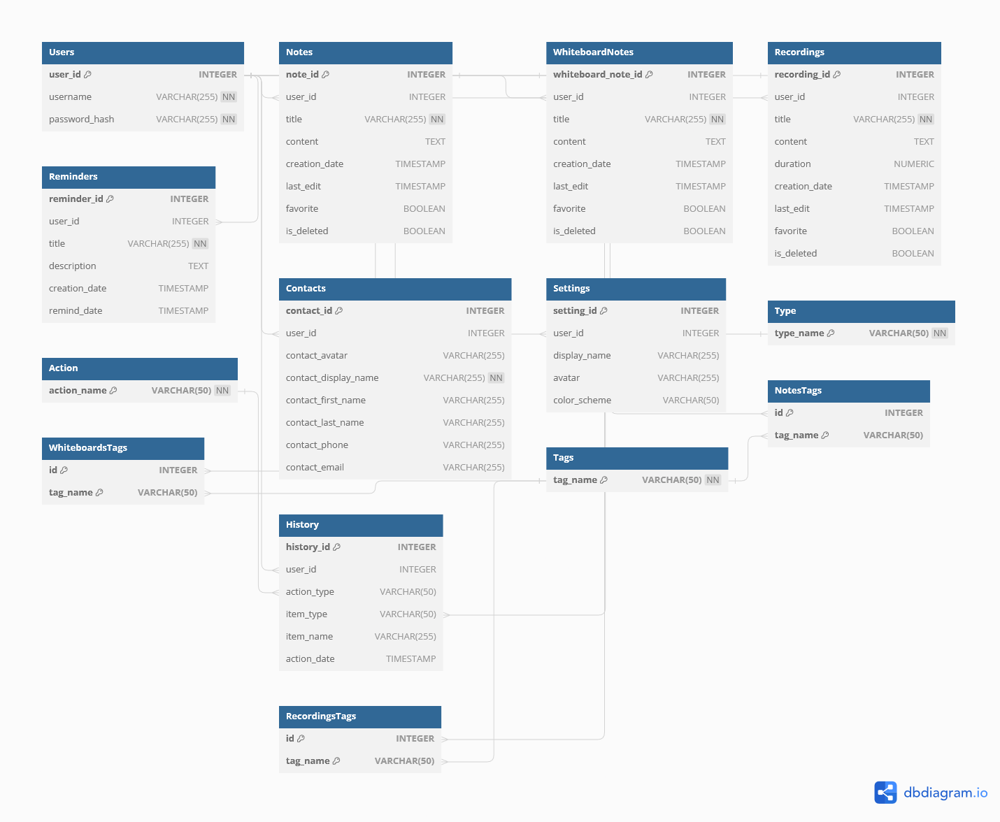

## Currently under construction.

# PEKO - Personal Encrypted Keep Organizer
Python application featuring a password-protected encrypted note-taking system with the ability to handle text, images, and sound, utilizing PostgreSQL for data storage and incorporating elliptic curve cryptography.

## Overview

PEKO is a password-protected encrypted note-taking application built in Python using Tkinter. It provides a secure environment for storing and managing text, images, and sound notes. The application utilizes PostgreSQL for efficient data storage and incorporates elliptic curve cryptography for enhanced security.

## Features

- **Password Protection**: Users can secure their accounts with a password. Password are stored as hashes in the database.
- **Encrypted Storage**: Notes are stored in an encrypted format for heightened privacy.
- **Multi-Format Support**: PEKO supports text, image, and sound notes for versatile content creation.
- **Database Integration**: Utilizes PostgreSQL for robust and organized data storage.
- **Elliptic Curve Cryptography**: Implements elliptic curve cryptography.

## Screenshots

### 1. Login/Register Screen

*Caption: login/register screen.*

### 2. Main Screen

*Caption: Main screen (under construction).*

## Database Diagram

### Entity-Relationship Diagram (ERD)

*Caption: Entity-Relationship Diagram illustrating the structure of the PostgreSQL database used by PEKO (see also: peko_database.pdf).*

# Resources Used

## 1. [CustomTkinter](https://github.com/TomSchimansky/CustomTkinter)
A customized set of Tkinter widgets for enhanced GUI design.

## 2. [Sublime Text](https://www.sublimetext.com/)
A text editor for code editing and project management.

## 3. [PostgreSQL](https://www.postgresql.org/)
Utilized as the backend database for storing and managing notes.

## 4. [Argon2](https://pypi.org/project/argon2-cffi/)
Used for password hashing and verifying.

## 5. [Crypto.PublicKey](https://pycryptodome.readthedocs.io/en/latest/src/public_key/ecc.html)
Will be used for encryption (and decryption) later.

## 6. GUI Elements
Can be found at https://icons8.com/. Detailed list later.

# License
This project is licensed under the MIT License.
